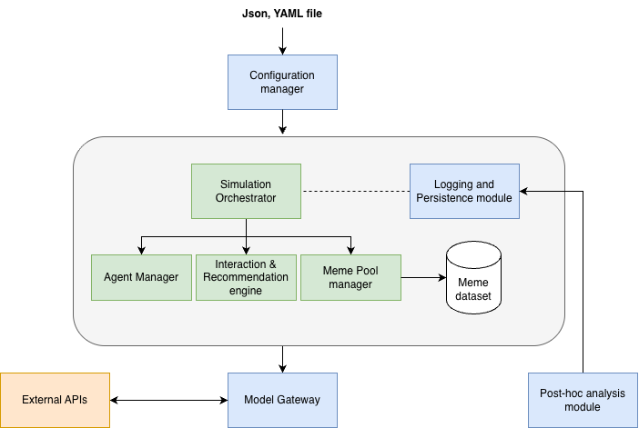

<div align="center">

# Chorus - Agentic Network Orchestration and Analysis

### LLM Agent Echo Chamber Simulation

A Python research harness that simulates populations of LLM-backed agents discussing a topic over multiple turns under a tunable echo-chamber mechanism, built to study code-mixed discourse, reasoning quality, and meme-driven polarization.

[](https://www.python.org/)
[](https://docs.pydantic.dev/)
[](#testing)
[](#build-status)
[](#running-a-simulation)
[](#architecture)
[](#license)

</div>

---

## Overview

`sandbox` seeds a population of `M` LLM-backed agents, each carrying a persona, a language condition, and a stance on a topic, then runs them through `K` discussion turns. On every turn, each scheduled speaker is shown a homophily-weighted sample of its neighbors' recent posts (an alpha-blend of similarity-weighted and uniform-random sampling, so `alpha` tunes how strong the echo chamber is), updates its stance, and posts. The simulation is built to answer three research questions from one shared run mechanism:

| | Research question |
|---|---|
| **RQ1** | Does Hindi-English code-mixed (Hinglish) discussion produce different polarization dynamics than English? |
| **RQ2** | Does the quality of an agent's stance-updating reasoning differ by language, and does it correlate with polarization speed? *(post-hoc analysis of RQ1's data)* |
| **RQ3** | Does injecting memes from a labeled dataset into the discussion accelerate polarization convergence? |

There is exactly **one simulation mode**. Memes are not a separate mode, they are a content-replacement mechanism: on a turn where a scheduled speaker is chosen to post a meme, that turn uses a dataset stance label instead of an LLM call, then gets sampled by the same echo-chamber mechanism as every other agent.

## Architecture

<div align="center">

</div>

The system is built as strict dependency tiers, where a module only depends on the tiers below it, never sideways or up.

```
Config Loader ──▶ ExperimentRun ──▶ Agent Manager creates M agents
                                          │
                          for each of K turns:
                          freeze snapshot ──▶ Interaction Engine resolves N neighbors per agent
                                          ──▶ Meme Pool Manager resolves scheduled meme speakers
                                          ──▶ dispatch concurrently
                                                 generated-text speakers ──▶ Model Gateway
                                                 meme speakers ──▶ free dataset lookup (no LLM call)
                                          ──▶ collect results, write Interaction records
                                          ──▶ advance snapshot, checkpoint ──▶ next turn
```

The frozen-snapshot ordering guarantee, that neighbor and meme-injection resolution both complete before any dispatch begins, so no agent's turn-*t* output is ever read by another agent's turn-*t* neighbor or meme resolution, is load-bearing for reproducibility and is referred to throughout the docs and codebase as **Fix F**.

### Build status

| Tier | Modules | Status |
|---|---|---|
| **Tier 0** | `models.py`, `config_loader.py`, `seed_manager.py`, `cost_tracker.py`, `rate_limiter.py` | Built and tested |
| **Tier 1** | `agent_manager.py`, `meme_pool_manager.py`, `model_gateway.py` | Built and tested |
| **Tier 2** | `interaction_engine.py`, `stance_parser.py`, `vision_fallback.py`, `logging_writer.py`, `checkpoint_manager.py` | Built and tested |
| **Tier 3** | `simulation_orchestrator.py`, `prompt_builder.py` | Built and tested |
| **Post-hoc analysis** | `stance_regression.py`, `coherence_scorer.py`, `codemix_ratio_tracker.py`, `sentiment_proxy.py`, `bimodality_analysis.py`, `embedding_cluster.py` | Planned, not yet implemented |

Tier 3 is the integration layer, the only module that calls every other component and wires them into the per-turn loop. **The system runs end to end today**; what remains unbuilt is offline analysis and a CLI.

Post-hoc analysis operates only on a completed run's `interactions.jsonl` and has no dependency on the orchestrator, so that tier is unblocked and can be built against data from a real run.

### Key design invariants

- **Never silently clamp or default.** Invalid `alpha` or `N`, out-of-range parsed stances, unrecognized model ids, and missing pricing entries all raise immediately rather than being coerced to a safe value.
- **Seeded RNGs only, never the global `random` module.** `SeedManager` hands out three independently and deliberately offset seeded `random.Random` instances, one each for neighbor sampling, meme injection, and persona assignment, so the three stochastic streams never correlate.
- **Fatal vs. per-agent-recoverable errors are distinguished deliberately.** A gateway or stance-parse failure (after retry budget exhaustion) becomes a `failed_logged_null` interaction for that one agent, and the turn continues for everyone else. An unexpected exception type is meant to propagate and abort the run, not be silently absorbed.
- **`CostTracker.record()` is synchronous**, called from the async `ModelGateway.generate()` by design.
- **Pydantic v2 models throughout**, with regex-constrained enums and cross-field validators, not dataclasses.
- **Vision support is a static lookup table**, keyed against `pricing_table.yaml`, not a runtime capability probe.
- **Unknown config keys are rejected** (`extra="forbid"`). A typo'd `meme_injections:` would otherwise load fine with injection off, so RQ3's meme-present arm would silently run as a second meme-absent arm.
- **A failed turn is logged but never applied.** It leaves no `stance_history` entry, so neighbours keep seeing the agent's last real post rather than a blank one, and no memory slot is spent on nothing.

See [`Architecture-docs/full_design_doc.md`](Architecture-docs/full_design_doc.md) for the module-by-module low-level design and [`Architecture-docs/sandbox_hld.md`](Architecture-docs/sandbox_hld.md) for the high-level design plus three passes of adversarial self-critique (the numbered "Fixes" referenced throughout the codebase).

The phase-by-phase build log lives in **git history** rather than the working tree. `git log --oneline` walks the tiers in order, and the commit messages carry the design decisions, the twelve defects found and fixed, and the reasoning behind each.

## Documentation site

A static, dependency-free docs site lives in [`docs/`](docs/index.html): project structure, architecture, per-pipeline sequence diagrams, the high-level design, and a searchable file-by-file reference. Open `docs/index.html` directly in a browser, no build step required.

Diagram source lives separately from the rendered site: the docs render pre-generated PNGs under `docs/assets/images/`, and the editable PlantUML behind each one is kept in [`Architecture-docs/plantuml/`](Architecture-docs/plantuml/). Edit the `.puml` source there, regenerate the PNG, and overwrite the matching file under `docs/assets/images/`.

## Getting started

```bash
# Clone and enter the repo
git clone git@github.com:ResearchDrafts/Chorus--Agentic-Network-Orchestration-and-Analysis.git
cd Chorus--Agentic-Network-Orchestration-and-Analysis

# Create and activate a virtual environment
python3 -m venv .venv
source .venv/bin/activate

# Install in editable mode with dev dependencies
pip install -e ".[dev]"
```

Requires **Python 3.11+**. Core dependencies: `pydantic`, `pyyaml`, `litellm`, `tenacity`, `pandas`, `statsmodels`.

## Running a simulation

Inference is **self-hosted on open-weight models**, so a full campaign costs nothing beyond GPU time. The models come straight off the HuggingFace Hub; only the compute is yours.

**Quickest path: the Colab notebook.** [`notebooks/chorus_colab.ipynb`](notebooks/chorus_colab.ipynb) does all of the below, from GPU check to first results. Open it in Colab, set the runtime to a T4, and run the cells top to bottom.

To do it by hand:

**1. Serve a model.** On a GPU box, or a Kaggle or Colab notebook:

```bash
vllm serve Qwen/Qwen2.5-7B-Instruct --dtype half --port 8000
```

On Kaggle, select **T4 x2, not P100**: vLLM requires CUDA compute capability 7.0 and the P100 is 6.0. `--dtype half` is required because bfloat16 needs 8.0 and the T4 is 7.5. For RQ3, serve `Qwen/Qwen2.5-VL-7B-Instruct` instead so memes reach agents as images; it needs about 18 GB, so add `--tensor-parallel-size 2` to span both T4s.

**2. Point a config at it.** Copy [`configs/example_run.yaml`](configs/example_run.yaml), which documents every field:

```yaml
model_backend_id: hosted_vllm/Qwen/Qwen2.5-7B-Instruct
api_base: http://localhost:8000/v1
rate_limits: {}        # empty: let vLLM batch all M agents concurrently
M: 100                 # Ohagi's baseline
N: 5
K: 10
```

**3. Launch.** There is no CLI yet, so a run is started from Python:

```python
from pathlib import Path
from sandbox.config_loader import load_run_config
from sandbox.cost_tracker import CostTracker
from sandbox.model_gateway import ModelGateway
from sandbox.rate_limiter import RateLimiter
from sandbox.simulation_orchestrator import build_orchestrator

run = load_run_config(Path("configs/example_run.yaml"))
tracker = CostTracker(run)
gateway = ModelGateway(run.model_backend_id, RateLimiter(run.rate_limits),
                       tracker, api_base=run.api_base)
await build_orchestrator(run, gateway, cost_tracker=tracker).run()
```

Output lands in `runs/{run_id}/`: `interactions.jsonl` (one record per agent-turn, the primary dataset), `agents_final.jsonl`, `run_config.json`, and `checkpoints/`.

**Start small.** Run `M=5, K=1` first. It is the cheapest way to find plumbing problems, and it produces the throughput figure needed to plan a real campaign.

**Resume is exact.** A run that dies, whether from a crash or a notebook session ending, resumes from its last checkpoint and produces output byte-identical to an uninterrupted run. Per-turn RNG streams are derived from `(seed, purpose, turn)` rather than consumed from a long-lived stream, so a resumed turn draws exactly what it would have drawn anyway.

> **Before a real campaign:** validate that your chosen model produces consistent Hinglish, on roughly 100 calls. If it cannot, RQ1 measures model deficiency rather than a language effect, and no post-hoc analysis repairs that.

## Testing

```bash
# Full test suite
python -m pytest

# A single test file
python -m pytest tests/test_agent_manager.py

# A single test
python -m pytest tests/test_agent_manager.py::test_name -q
```

`asyncio_mode = "auto"` is set in `pyproject.toml`, so `async def test_*` functions run without needing `@pytest.mark.asyncio`.

## Repository layout

```
sandbox/              Package source (15 modules), organized by dependency tier
tests/                17 test modules, including one end-to-end integration test
configs/              Run configs; example_run.yaml is the worked example
data/personas/        Persona fixtures (plain text, one per line, despite .jsonl)
data/memes/           Meme fixtures (JSONL) and their images
pricing_table.yaml    Provider/model pricing; self-hosted entries are a real 0.0
Architecture-docs/    HLD, LLD, and PlantUML diagram source
docs/                 Static developer documentation site
runs/                 Simulation output, one subdirectory per run
```

## License

No license has been published for this repository yet. All rights reserved by the authors until one is added.
